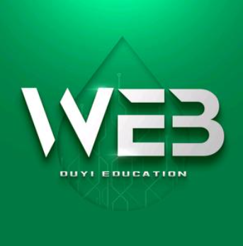

  
  

    <!-- <a href="https://www.douyin.com/user/MS4wLjABAAAAeIIkCgELXG6XdUxuE9nQ6W4AfS-aoPFbtmnBL8ytcYtBSyurgePBYZXJpB0LJBCT"> -->
      
    <!-- </a> -->
  

  

    
    
    
    
  

## 介绍

本项目包括渡一教育的：提薪课、学习频道、必修课和教科频道。主要为一些本人觉得比较有意思，或者比较有用的视频做一个整理，方便大家查阅。本项目的初衷是为了方便自己，也方便大家。如果有侵权的地方，请联系我删除。

> 本项目的代码参考均来自于渡一教育的抖音视频教程，如果你觉得本项目对你有帮助，请给我一个 star，谢谢。

## 更新中…

新版代码在 `main` 分支，旧版代码在 `master` 分支，新版代码使用 `Nextjs 15` + `mdx` 模式，用文档编写解释以及见解之外还可以预览 demo 效果，目前已有预览页面，后续将陆续完善，欢迎大家提出意见。

-

